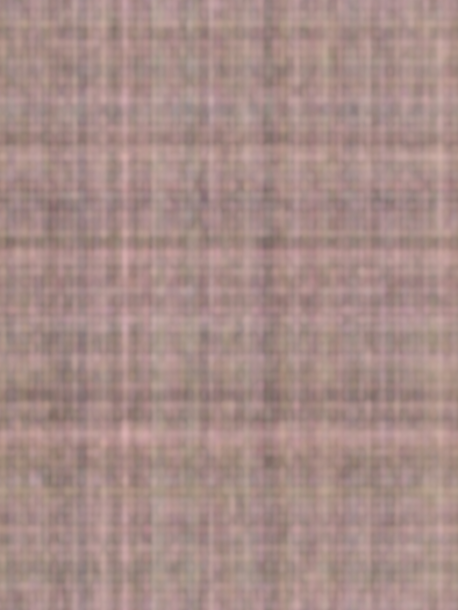
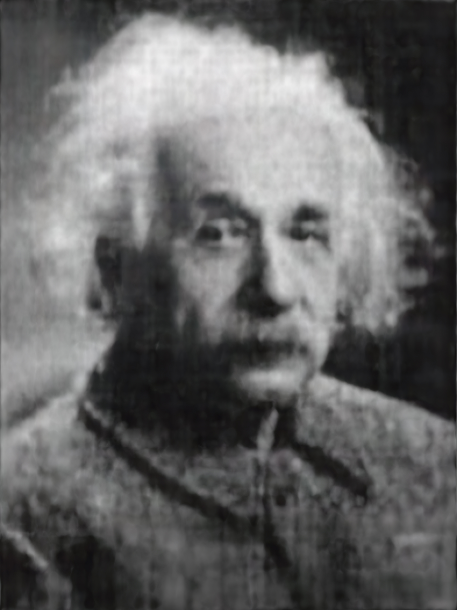
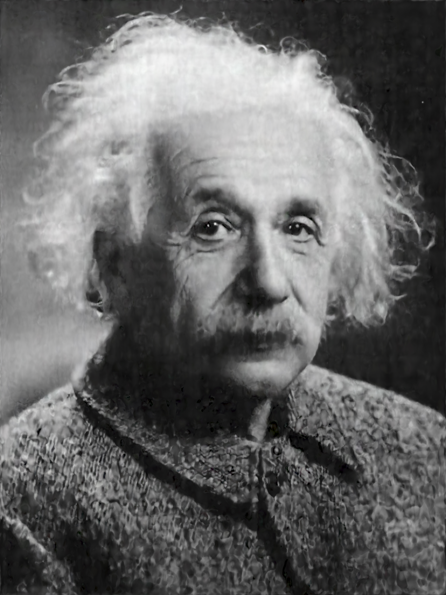

# Tiny ROCm Neural Networks

A port of [tiny-cuda-nn](https://github.com/NVlabs/tiny-cuda-nn) to AMD ROCm, enabling lightning-fast neural network training and inference on AMD GPUs (MI300X and similar).

This framework provides the same ["fully fused" multi-layer perceptron](data/readme/fully-fused-mlp-diagram.png) ([paper](https://tom94.net/data/publications/mueller21realtime/mueller21realtime.pdf)) and versatile input encodings from the original tiny-cuda-nn, adapted to run natively on AMD hardware via HIP, hipBLAS, and rocWMMA.

## Performance on AMD MI300X

Benchmarked on AMD Instinct MI308X, ROCm 6.4.3, PyTorch 2.6.0.
Network: 128 neurons, 5 hidden layers, OneBlob encoding (64 bins), batch size 2^18.

| Configuration | Training (ms/step) | Training Throughput |
|:---|:---:|:---:|
| **tiny-rocm-nn** (FP16 fused) | 7.55 | 34.7M samples/sec |
| PyTorch FP32 | 9.47 | 27.7M samples/sec |
| PyTorch FP16 (AMP) | 6.05 | 43.3M samples/sec |
| PyTorch FP16 + torch.compile | 5.89 | 44.5M samples/sec |

tiny-rocm-nn is **1.25x faster** than PyTorch FP32 for training. PyTorch AMP/compile can be faster due to mature hipBLAS FP16 optimizations; the fused kernel approach has further optimization potential on AMD's MFMA architecture.

## Example: Learning a 2D Image

```sh
tiny-rocm-nn$ ./build/mlp_learning_an_image data/images/albert.jpg
```

| Step 0 | Step 100 | Step 1000 | Step 2000 |
|:---:|:---:|:---:|:---:|
|  |  |  |  |

Training converges to a clean image within ~1000 steps, with loss dropping from 8.79 to 0.05 over 5000 steps.

## Requirements

- An **AMD GPU** with MFMA (Matrix Fused Multiply-Add) support: MI300X, MI250X, MI210, or similar (gfx90a, gfx942 architectures)
- **[ROCm](https://rocm.docs.amd.com/) 6.x** (tested with 6.4.3)
- **hipBLAS** and **rocWMMA** (included with ROCm)
- A **C++17** capable compiler (GCC 9+ recommended)
- **[CMake](https://cmake.org/) v3.21 or higher**

```sh
sudo apt-get install build-essential git cmake
```

## Building

Clone the repository and build:

```sh
git clone --recursive https://github.com/ZJLi2013/tiny-rocm-nn.git
cd tiny-rocm-nn
cmake . -B build -DCMAKE_BUILD_TYPE=RelWithDebInfo -DCMAKE_HIP_ARCHITECTURES=gfx942
cmake --build build --config RelWithDebInfo -j
```

Adjust `CMAKE_HIP_ARCHITECTURES` to match your GPU (e.g., `gfx90a` for MI250X, `gfx942` for MI300X).

## Docker (Recommended)

Using the official ROCm PyTorch container:

```sh
docker run -it --device=/dev/kfd --device=/dev/dri \
  --group-add video --cap-add=SYS_PTRACE \
  -v $(pwd):/workspace \
  rocm/pytorch:rocm6.4.3_ubuntu22.04_py3.10_pytorch_release_2.6.0

# Inside container:
cd /workspace/tiny-rocm-nn
cmake . -B build -DCMAKE_BUILD_TYPE=RelWithDebInfo -DCMAKE_HIP_ARCHITECTURES=gfx942
cmake --build build -j
./build/mlp_learning_an_image data/images/albert.jpg
```

## Usage (C++ API)

```cpp
#include <tiny-cuda-nn/common.h>

nlohmann::json config = {
	{"loss", {{"otype", "RelativeL2"}}},
	{"optimizer", {{"otype", "Adam"}, {"learning_rate", 1e-2}}},
	{"encoding", {{"otype", "OneBlob"}, {"n_bins", 64}}},
	{"network", {
		{"otype", "FullyFusedMLP"},
		{"activation", "ReLU"},
		{"output_activation", "None"},
		{"n_neurons", 128},
		{"n_hidden_layers", 5},
	}},
};

using namespace tcnn;
auto model = create_from_config(n_input_dims, n_output_dims, config);

GPUMatrix<float> training_inputs(n_input_dims, batch_size);
GPUMatrix<float> training_targets(n_output_dims, batch_size);

for (int i = 0; i < n_steps; ++i) {
	float loss;
	model.trainer->training_step(training_inputs, training_targets, &loss);
}

GPUMatrix<float> inference_inputs(n_input_dims, batch_size);
GPUMatrix<float> inference_outputs(n_output_dims, batch_size);
model.network->inference(inference_inputs, inference_outputs);
```

## Porting Notes (CUDA → ROCm)

Key adaptations made during the port:

1. **cuBLAS → hipBLAS**: All GEMM operations use `hipblasGemmEx` with FP32 compute for numerical stability
2. **CUDA WMMA → rocWMMA**: Tensor core operations ported to AMD's MFMA instructions via `rocwmma::mma_sync`
3. **Wave64 addressing**: AMD GPUs use 64-thread wavefronts (vs CUDA's 32-thread warps). All `int4` vectorized copy loops adjusted for `WAVE_SIZE=64`
4. **Fragment layout fix**: rocWMMA `accumulator` and `matrix_a` fragments have different register-to-element mappings. Element-wise activation backward moved to shared memory to avoid silent data corruption
5. **Warp intrinsics**: `__shfl_sync` → `__shfl`, `__shfl_xor_sync` → `__shfl_xor` (ROCm implicit synchronization)

## Components

| Networks | Source | Description |
|:---|:---|:---|
| Fully Fused MLP | `src/fully_fused_mlp.cpp` | Fast MLP using rocWMMA + hipBLAS. Supports hidden layers of 64 or 128 neurons. |

| Encodings | Description |
|:---|:---|
| OneBlob | Gaussian kernel encoding |
| Frequency | Positional encoding (NeRF-style) |
| Grid (Hash) | Multiresolution hash encoding |
| Identity | Pass-through |
| Composite | Combine multiple encodings |

| Losses | Optimizers |
|:---|:---|
| L1, L2, Relative L2 | Adam, SGD, Novograd |
| MAPE, SMAPE | Shampoo, EMA, Lookahead |
| Cross Entropy | Exponential Decay |

## License

This framework is based on [tiny-cuda-nn](https://github.com/NVlabs/tiny-cuda-nn) by Thomas Müller (NVIDIA), licensed under the BSD 3-clause license. See `LICENSE.txt` for details.

If you use the original framework in your research:
```bibtex
@software{tiny-cuda-nn,
	author = {M\"uller, Thomas},
	license = {BSD-3-Clause},
	month = {4},
	title = {{tiny-cuda-nn}},
	url = {https://github.com/NVlabs/tiny-cuda-nn},
	version = {1.7},
	year = {2021}
}
```
